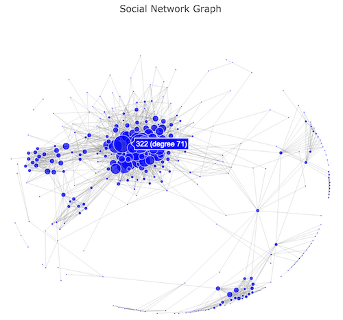

# Social Network Graphs
Social networks can be viewed as an example of a computational (and mathematical) data structure called a [Graph](https://en.wikipedia.org/wiki/Graph_(abstract_data_type)). A **Graph** is a collection of **nodes** (elements in the graph; a.k.a vertices) and **edges** (connections between those elements). For example, we can graph a social network with the _nodes_ representing the people who are part of that network, and the _edges_ between nodes representing whether those two people are friends. Analyzing and visualizing graphs can reveal significant and fascinating details about the systems (social or otherwise) that they represent, and mathematicians and computer scientists have devised a number of **algorithms** for studying large graphs.

You will be writing a program that is able to both analyze and visualize a medium-sized network graph. But while its possible to implement graph analysis algorithms on your own (they're just combinations of loops and conditionals!), it can take a lot of time, effort, and debugging to get them working correctly. In practice, rather than re-implementing every algorithm ourselves, programmers will find and use **external libraries** (e.g., sets of pre-written functions) to perform common tasks like graph analysis. Indeed, being able to find, understand, and use code that _other people_ have written is a huge part of successfully developing computer programs. Thus in this assignment, you will practice learning to utilize some existing libraries for working with network graphs and for plotting simple visualizations.
    

### Objectives
By completing this challenge you will practice and master the following skills:

* Working with Python objects (and their attributes) as data structures
* Structuring data as a graph
* Analyzing the properties of network graphs
* Writing programs that utilize external modules
* Learning external modules from provided documentation

### References
One of the big goals of this assignment is for you to practice learning to utilize new libraries on your own (the syntax will be the same, you just need to learn what methods to call and values to pass as parameters). The important references for this assignment are:

* [Social Networks](http://www-rohan.sdsu.edu/~gawron/python_for_ss/course_core/book_draft/Social_Networks/Social_Networks.html) is a textbook chapter on studying social networks as graphs. It gives clear, readable explanations of most of the graph concepts you'll be studying.
* [NetworkX](http://networkx.readthedocs.io/en/networkx-1.11/) the graph library you'll be using.
* [Plotly](https://plot.ly/python/) the plotting library you'll be using ([full api reference](https://plot.ly/python/reference/)).


## Setup: Fork and Clone
As you will do for all assignments in this course, you should start by forking and cloning this repository to your local machine. Repositories will contain starter code (if any), as well as the `SUBMISSION.md` file you will need to complete.

For this assignment, the repo includes the start of a program `graph_processor` which you will need to complete. As with the previous assignment, the provided code provides a really basic **command-line interface** that you can use to run your program---your task will be to create the ___functions___ that the command-line interface calls to do work. Note that this command-line interface is much more basic than the Twitter assignment.

### Getting Graph Data
We will once again be using "real-world" social network data to test and develop our program against. However, we won't be using "live" network code, but instead real-world data that has been gathered, anonymized, and _cleaned_ for researchers to more easily study. [Stanford has a [large collection](https://snap.stanford.edu/data/index.html) of network data sets, include extracted graphs for Facebook, Twitter, and many others (there are [other repositories](http://www-personal.umich.edu/~mejn/netdata/) of network data as well).

In particular, for this assignment you'll be using Stanford's [Facebook](https://snap.stanford.edu/data/egonets-Facebook.html) dataset, which consists of network representations of a 10 people's "friends lists".

- You'll need to download the `facebook.tar.gz` file, which contains data for the 10 networks. You'll also need to download the `facebook_combined.txt.gz` file which contains a combined graph of the 10 networks. I recommend putting them in a folder in your repo called `data/`

- These are [gzipped tarball](https://en.wikipedia.org/wiki/Tar_(computing)) files, which are a basically a unix-based version of `.zip` archive files. Most operating systems should be able to decompress them just like you decompress a `.zip`, though you may need to download extracting software like [7zip](http://www.7-zip.org/).


## Part 1. Loading the Graph
The first step in writing a Python program to work with graph data is actually getting that data into Python. Implement a function **`load_graph()`** that takes in the _name_ of a file containing graph edge data, and _returns_ a `networkx.Graph` object representing the edges in that file.

The `facebook` archive contains various files describing each network, detailed in the [readme-Ego.txt](https://snap.stanford.edu/data/readme-Ego.txt) file. We're mainly interested in the `.edges` files, which contain lists of graph edges written as pairs of node numbers separated by whitespace (e.g., `2 3` represents an edge between Node 2 and Node 3). Note that your method only needs to load one `.edges` file.

- Processing these file will be similar to processing a `.csv` file.

- Just FYI: because of how these friends-lists are built, technically all the nodes included in the `.edges` file are also connected to the "ego" node; e.g., all the nodes in `0.edges` are connected to Node 0. You will **not** need to account for this.

In order to structure data as a graph, you should use the [**NetworkX**](http://networkx.readthedocs.io/en/networkx-1.11/overview.html) library. It provides classes and _many_ functions for working with graphs, has well written and readable documentation, and is implemented entirely in Python in case you want to check out the source code.

- You will need to install the module and `import` it into your script.

- There are other libraries that we could consider instead. For example, [**igraph**](http://igraph.org/python/) performs very similar functions, and is up to 150x faster than `networkX` because it is implemented in C++ and simply accessed via Python. However, this means you need to have the C++ compiler on your machine to install it... so we'll use NetworkX instead.

You can test this function with

```
python3 graph_processer.py load data/facebook/0.edges
```

(adjusting the path to the `0.edges` file as necessary), which should produce an output:

```
loaded graph with 333 nodes and 2519 edges
```
- As always, your function (and in fact all of your functions) should just _return_ a value, not print out the results! You are welcome to include print statements for testing, but be sure to remove them when you're done!

- Be sure and include a [docstring](https://www.python.org/dev/peps/pep-0257/) for all your functions!

You'll need to implement this method before the others, as it is required for the next steps (though you can actually do Part 2 or Part 3 in whichever order you want).


## Part 2. Analyzing the Graph
The next step is to utilize the NetworkX library to perform some analysis on the graph you've loaded. Implement a function **`analyze_graph()`** that takes in a `networkx.Graph` object as a parameter, and **prints** the following information about the graph:

1. The number of nodes in the graph.
2. The number of edges in the graph.
3. The number of connected components in the graph.
4. The [diameter](https://en.wikipedia.org/wiki/Distance_(graph_theory)) of the graph---i.e., the maximum (shortest) distance between any two nodes. (Technically the diameter of a disconnected graph is infinity; but for our purposes you can just consider the distance between any two _connected_ nodes).
5. The average length of the shortest path between any two connected nodes.
6. The [clustering coefficient](https://en.wikipedia.org/wiki/Clustering_coefficient) of the graph.
7. The 10 nodes with the highest [degree centrality](https://en.wikipedia.org/wiki/Centrality#Degree_centrality), sorted in descending order by degree. (Calculating [betweenness centrality](https://en.wikipedia.org/wiki/Centrality#Betweenness_centrality) is equivalently easy, but this can take a **very** long time on large graphs so is not recommended).

For example, if you run the command

```
python3 graph_processer.py analyze data/facebook/0.edges
```

Your function should **print** output such as:

```
### Analyzing Graph ###
Number of Nodes:  333
Number of Edges:  2519
Number of Components:  5
Graph diameter: 11
Average shortest path length: 3.7524459221891004
Clustering coefficient 0.5082445417696632
Nodes with highest degree centrality:
  '56' (centrality: 0.23192771084337352)
  '67' (centrality: 0.22590361445783133)
  '271' (centrality: 0.21686746987951808)
  '322' (centrality: 0.213855421686747)
  '25' (centrality: 0.20481927710843376)
  '26' (centrality: 0.20180722891566266)
  '21', '277', '252' (centrality: 0.1927710843373494)
  '122' (centrality: 0.18674698795180725)
  '119' (centrality: 0.18373493975903615)
  '239' (centrality: 0.1746987951807229)

```

___Important point!___ many of these properties can be determined just by calling the appropriate function from the `networkx` library: your task is to (a) find the appropriate function (b) figure out how to call that function, and (c) use the function to produce the expected output.

- The [NetworkX Algorithms](http://networkx.readthedocs.io/en/networkx-1.11/reference/algorithms.html) reference is a good place to start looking for functions.

Also be sure to answer the relevant questions using these statistics in the `SUBMISSION.md` file.


## Part 3. Plotting the Graph
In addition to analyzing a graph's statistics, your program should be able to create a visual representation of that graph so that a person can visually identify further properties. Implement a function **`plot_graph()`** that takes in a `networkx.Graph` object and generates and displays a visualization of that graph.

For example, if you run the command

```
python3 graph_processer.py plot data/facebook/0.edges
```

Your function should produce a visualization like:



(Note that because there is some _randomization_ in where Nodes are displayed, your visualization won't look exactly the same. You're also welcome to adjust visual properties like colors, etc. if you want).

Items to note about this visualization (and the one your program should produce):

1. The plot has a title at the top
- The nodes are represented as circles colored a shade of blue (because it's Facebook data after all!)
- The nodes are also sized based on their degree centrality: the larger the centrality, the larger the node. Make sure every node is visible though (a _minimum_ size of 3 pixels worked well for me).
- Edges are represented with light-grey lines.
- The nodes are positioned so they "cluster" somewhat: that is, nodes that are connected are close together, and nodes that are disconnected are further apart.
- If you "hover" the mouse over a node, it displays a small tooltip with the "name" (number) of the node, as well as its [degree](https://en.wikipedia.org/wiki/Degree_(graph_theory)).
- There are no other lines, axis, legends, etc. on the graph.

In order to produce this visualization, you should use the [**Plotly**](https://plot.ly/python/) plotting library. This is an easy to install library that works on multiple platforms. It is used to generate navigable plots (on which you can zoom and pan around).

- The Plotly library is monetized by having you host your visualizations on their cloud platform. However, it is also simple to use Plotly in [offline mode](https://plot.ly/python/getting-started/#offline-use), which will generate an HTML file and then open it in a browser for you to view. 

- The Plotly library is less thoroughly and cleanly documented than NetworkX; it is explained primarily through examples which you can then adapt and modify. You are welcome and expected to use these examples as a starting point for your own work, but you should include **copious comments** explaining what the code you've copied in does.

#### A note about layout and positioning
The best ways to automatically positions nodes of a graph so that they make sense is a fascinating area of study and the source of many wonderful algorithms. The most interesting ones are known as [force-directed layouts](http://en.wikipedia.org/wiki/Force-directed_graph_drawing). These algorithms treat the graph as existing under a set of physical "forces" (think gravity or magnetism) that move the nodes around the graph until they've settled into their positions--indeed, such algorithms are also known as spring-and-damper algorithms. Because these algorithms model physical forces, we can often borrow simple rules from physics such as [Columb's Law](http://en.wikipedia.org/wiki/Columb%27s_law) (the "inverse square law") and [Hooke's Law](http://en.wikipedia.org/wiki/Hooke%27s_law) to implement them.

For this assignment, you should use the **Fruchterman-Reingold** layout algorithm (also known as a "spring layout"), which doesn't produce the "best" looking layouts but is very simple to understand---and more importantly is built into NetworkX. In this algorithm, Nodes are treated like magnets that _repel_ one another, while edges are treated as springs that _attract_ the connected nodes. The algorithm uses a loop to "bounce" nodes into position based on these forces. It's a really neat technique, the pseudocode for which can be found on page 4 of the [original paper](http://faculty.washington.edu/joelross/courses/archive/f14/cs261/lab/j/fruchterman91graph.pdf), as well as in the documentation for the NetworkX implementation.

- You should apply this algorithm with at least 100 _iterations_ to get it to look good.

- The above details aren't totally relevant, but I think these things are really cool and so wanted to point out how they work to you. I almost had you implement the algorithm yourself based on the pseudocode... but it seemed a bit much for the assignment.

    - If you're interested in more of these algorithms, like for future network visualizations, [Kobourov 2007](http://cs.brown.edu/~rt/gdhandbook/chapters/force-directed.pdf) (brown.edu) has a nice summary of different options---the _Kamada-Kawai_ algorithm produces particularly nice results, but unfortunately isn't included in NetworkX (but I'll see if I can write up a version for you to use).

## Testing the Program
While this spec gives details for the results when analyzing/plotting `0.edges`, your program should be able to work with any of the other 9 networks. 

Pick another one of the 9 networks, and run both the analysis and the plotting procedures on it. Save the results to files `analysis.txt` and `plot.html` respectively (for the later, just rename the `temp-plot.html` file that Plotly generates).

Finally, run your program on full `facebook_combined.txt` graph. Note that both analyzing and plotting this data can take a little while---about 3 minutes each on my workhorse laptop, which means up to 10-15 minutes on slower hardware. We will talk next week about why the bigger graph takes so much longer!

- You can also use your program on other network data sets, though you may need to clean the data or otherwise adjust how it is parsed.

Also remember to answer the questions about the combined network in the `SUBMISSION.md` file!


## Submit Your Solution
Remember to `add`, `commit`, and `push` your script once it's finished!

In order to submit you assignment, you  need to both `push` your completed solution to your GitHub repository (the one in the cloud that you created by forking), **and** submit a link to your repository to [Canvas](https://canvas.uw.edu/) (so that we know where to find your work)!

Before you submit your assignment, double-check the following:

1. Confirm that your program is completed and works without errors. All three commands should be able to run without errors, producing the expected output. 
* Be sure and fill out the **`SUBMISSION.md`** included in the assignment directory, answering the questions.
* `commit` the final version of your work, and `push` your code to your GitHub repository.

Submit a a link to your GitHub repository via [this canvas page](https://canvas.uw.edu/courses/1041440/assignments/3208931).

The assignment is due on **Tue May 10 at 6:00 AM**.

### Grading Rubric
See the assignment page on Canvas for the grading rubric.

_Based on an assignment by Jean Mark Gawron._ 